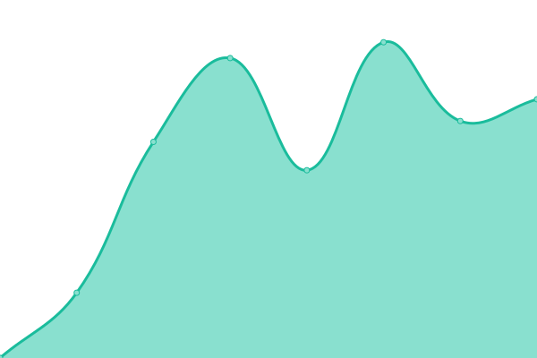

# [📈 Live Status](https://neil-buckley.github.io/ellis-status): <!--live status--> **🟩 All systems operational**

This repository contains the open-source uptime monitor and status page for [Neil Buckley](https://neil-buckley.github.io/ellis-status), powered by [Upptime](https://github.com/upptime/upptime).

With [Upptime](https://upptime.js.org), you can get your own unlimited and free uptime monitor and status page, powered entirely by a GitHub repository. We use [Issues](https://github.com/neil-buckley/ellis-status/issues) as incident reports, [Actions](https://github.com/neil-buckley/ellis-status/actions) as uptime monitors, and [Pages](https://neil-buckley.github.io/ellis-status) for the status page.

<!--start: status pages-->
<!-- This summary is generated by Upptime (https://github.com/upptime/upptime) -->
<!-- Do not edit this manually, your changes will be overwritten -->
<!-- prettier-ignore -->
| URL | Status | History | Response Time | Uptime |
| --- | ------ | ------- | ------------- | ------ |
|  [Ellis Application - https://searches.ellis.ie/](https://searches.ellis.ie/) | 🟩 Up | [ellis-application-https-searches-ellis-ie.yml](https://github.com/neil-buckley/ellis-status/commits/HEAD/history/ellis-application-https-searches-ellis-ie.yml) | 

 623ms
     
 | 

<a href="https://ellis-status.lphmedia.com/history/ellis-application-https-searches-ellis-ie">100.00%</a>
    

|  [Ellis Site - https://www.ellis.ie/](https://www.ellis.ie/) | 🟩 Up | [ellis-site-https-www-ellis-ie.yml](https://github.com/neil-buckley/ellis-status/commits/HEAD/history/ellis-site-https-www-ellis-ie.yml) | 

 724ms
     
 | 

<a href="https://ellis-status.lphmedia.com/history/ellis-site-https-www-ellis-ie">100.00%</a>
    

|  [ISI Public Site - https://isi.jahs.ie/](https://isi.jahs.ie/) | 🟩 Up | [isi-public-site-https-isi-jahs-ie.yml](https://github.com/neil-buckley/ellis-status/commits/HEAD/history/isi-public-site-https-isi-jahs-ie.yml) | 

 1561ms
     
 | 

<a href="https://ellis-status.lphmedia.com/history/isi-public-site-https-isi-jahs-ie">100.00%</a>
    

|  [Land Registry Public Site - https://www.landdirect.ie](https://www.landdirect.ie/pramap/) | 🟩 Up | [land-registry-public-site-https-www-landdirect-ie.yml](https://github.com/neil-buckley/ellis-status/commits/HEAD/history/land-registry-public-site-https-www-landdirect-ie.yml) | 

 1104ms
     
 | 

<a href="https://ellis-status.lphmedia.com/history/land-registry-public-site-https-www-landdirect-ie">100.00%</a>
    

|  [Digital Ocean - https://status.digitalocean.com/](https://status.digitalocean.com/api/v2/status.json) | 🟩 Up | [digital-ocean-https-status-digitalocean-com.yml](https://github.com/neil-buckley/ellis-status/commits/HEAD/history/digital-ocean-https-status-digitalocean-com.yml) | 

 169ms
     
 | 

<a href="https://ellis-status.lphmedia.com/history/digital-ocean-https-status-digitalocean-com">95.72%</a>
    

|  ISI API | 🟩 Up | [isi-api.yml](https://github.com/neil-buckley/ellis-status/commits/HEAD/history/isi-api.yml) | 

 90ms
     
 | 

<a href="https://ellis-status.lphmedia.com/history/isi-api">100.00%</a>
    

|  CRO API | 🟩 Up | [cro-api.yml](https://github.com/neil-buckley/ellis-status/commits/HEAD/history/cro-api.yml) | 

 470ms
     
 | 

<a href="https://ellis-status.lphmedia.com/history/cro-api">100.00%</a>
    

<!--end: status pages-->

[**Visit our status website →**](https://neil-buckley.github.io/ellis-status)

## 📄 License

- Powered by: [Upptime](https://github.com/upptime/upptime)
- Code: [MIT](./LICENSE) © [Neil Buckley](https://neil-buckley.github.io/ellis-status)
- Data in the `./history` directory: [Open Database License](https://opendatacommons.org/licenses/odbl/1-0/)
